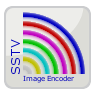

# SSTV Encoder 2

Image encoder for Slow-Scan Television (SSTV) audio signals

### Modes

Supported SSTV modes:
* **Martin Modes**:  Martin 1, Martin 2  
* **PD Modes**:      PD 50, PD 90, PD 120, PD 160, PD 180, PD 240, PD 290   
* **Robot Modes**:   Robot 36 Color, Robot 72 Color  
* **Scottie Modes**: Scottie 1, Scottie 2, Scottie DX 
* **Wraase Modes**:  Wraase SC2 180

The mode specifications are taken from the Dayton Paper, JL Barber, "Proposal for SSTV Mode Specifications", 2000:  
http://www.barberdsp.com/downloads/Dayton%20Paper.pdf

### Image

To load an image:
* tap **"Take Picture"** or **"Pick Picture"** menu button, or  
* use the **Share** option of an app like e.g. Gallery.

To keep the aspect ratio, black borders will be added if necessary.  
Original image can be resend using another mode without reloading.  
After image rotation or mode changing the image will be scaled to that mode's native size.  
After closing the app the loaded image will not be stored.

### Text Overlay

Actions for working with text overlays:
* Single tap **to add** a text overlay.  
* Single tap on text overlay **to edit** it.  
* Long press **to move** text overlay.  
* Remove the text **to remove** a text overlay.

After closing the app all text overlays will be stored and reloaded when restarting.

### Menu

Available menu options:
* **"Play"**: Sends the image
* **"Stop"**: Stops the current sending and empties the queue
* **"Pick Picture"**: Opens an image viewer app to select a picture
* **"Take Picture"**: Starts a camera app to take a picture
* **"Save as WAVE File"**: Creates a wave file in the Music folder in SSTV Encoder album
* **"Rotate Image"**: Rotates the image by 90 degrees
* **"Modes"**: Lists all supported modes

### Installation

The working app "SSTV Encoder" can be installed 

on Google Play:  
https://play.google.com/store/apps/details?id=om.sstvencoder

or on F-Droid:  
https://f-droid.org/packages/om.sstvencoder/

# SSTV Image Decoder

Open Source Code:  
https://github.com/xdsopl/robot36/tree/android

### Installation

The working app "Robot36 - SSTV Image Decoder" can be installed

on Google Play:  
https://play.google.com/store/apps/details?id=xdsopl.robot36

or on F-Droid:  
https://f-droid.org/packages/xdsopl.robot36/
